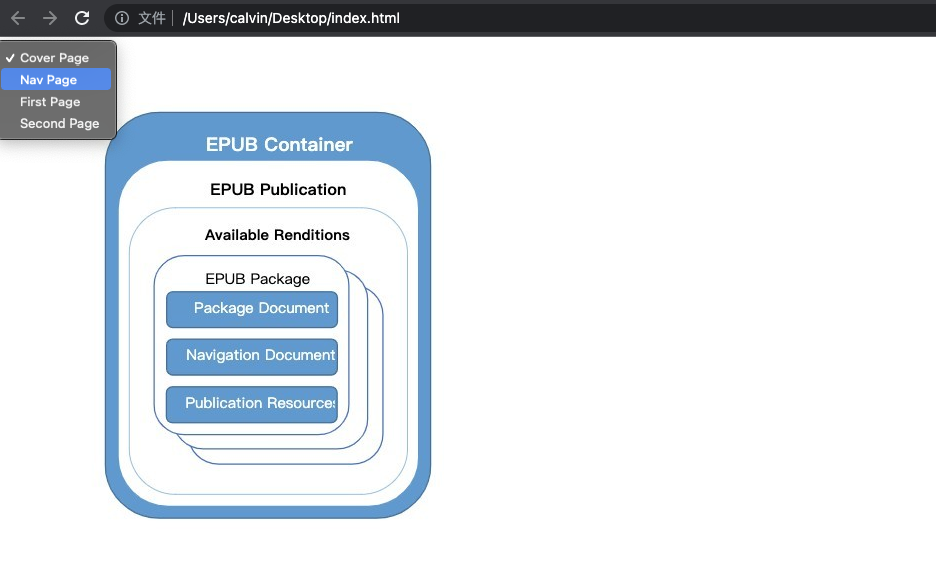

> 一直在看 Epub 类型的图书， 很好奇一个 Epub 解析器是如果工作的。 碰巧看到了 Epub.js， 体验了一下还可以。 就尝试分析一下它的实现。本文会先介绍下 EPUB 格式,再来分析 Epubjs 的实现. 我前端经验仅限于了解常见标签含义，可能会有各种错误恳请斧正。

# Epub
EPub是一个自由的开放标准，属于一种可以“自动重新排版”的内容；也就是文字内容可以根据阅读设备的特性，以最适于阅读的方式显示。EPub档案内部使用了XHTML或DTBook（一种由DAISY Consortium提出的XML标准）来展现文字、并以zip压缩格式来包裹档案内容。EPub格式中包含了数位版权管理（DRM）相关功能可供选用
> 以上来自维基百科: https://zh.wikipedia.org/wiki/EPUB

本文参考的规范为: [Epub 3.2](https://www.w3.org/publishing/epub32/epub-spec.html#sec-epub-rs-conf)
该规范发布于 2019-05-08, 定义了 EPUB 图书格式和 EPUB 图书的浏览器应实现的功能. Epub格式由以下规范组成:
  * EPUB Packages — 定义内容的每个Rendition的要求。
  * EPUB Content Documents — 定义了在 EPUB 出版物上下文中使用的 XHTML、SVG 和 CSS 的配置文件。
  * EPUB Media Overlays — 定义了文本和音频同步的格式和处理模型。
  * EPUB Open Container Format — 定义了一种文件格式和处理模型，用于将一组相关资源封装到单个文件 (ZIP) EPUB 容器中。
  * EPUB Accessibility — 定义 EPUB 出版物的可访问性一致性和发现要求。

如下图:
EPUB图书的内容是由一个或多个Rendition组成，每个Rendition都由所谓的EPUB Package 表示。
EPUB Package包含呈现内容所需的所有资源。其中的关键文件是Package Document，它包括阅读系统用于向用户呈现EPUB图书的所有元数据（例如标题和作者等）。它还提供了一个完整的资源清单，并包括一个`SPINE`(用来表是文档出现的顺序)。
EPUB Package还包括另一个称为EPUB Navigation Document的文件。本文档提供了导航功能，例如目录，允许用户快速轻松地导航内容。
EPUB 图书的资源捆绑在一个基于 ZIP 的文件中，文件扩展名为.epub. 作为符合 ZIP 格式的文件，EPUB 出版物可以被许多软件程序解压缩，从而简化了它们的使用。


## 参考规范来制作一个简单Epub 图书
### 按照下图的方式来组织目录和文件

### mimetype 文件名固定, 内容也固定位: `application/epub+zip`
### META-INF/container.xml 为入口文件,文件名固定.
内容如下:
其中rootfile指定了package file

```html
<?xml version='1.0' encoding='utf-8'?>
<container xmlns="urn:oasis:names:tc:opendocument:xmlns:container" version="1.0">
  <rootfiles>
    <rootfile full-path="OPS/package.opf" media-type="application/oebps-package+xml"/>
  </rootfiles>
</container
```

### OPS/package.opf
Package 文件, 定义了书籍的 meta 信息, 资源列表和阅读顺序(Spine)
内容如下:
  * metadata: 标签定义的作者等信息
  * manifest: 定义了资源列表,如 正文页面, 目录, 封面图片, CSS, JS 等等
  * spine: 定义了书籍连续阅读的顺序.
    *   Liner 代表顺序是否为必要顺序. 如目录和封面不一定强制按照这个顺序来阅读. 或者说是在做阅读器是可以把 Liner=no页面弹窗 
    *   和目录/书签最显著的区别, Spine 是按照资源文件来组织循序. 目录/书签等是可以指定到资源内的标签.

```html
<?xml version='1.0' encoding='utf-8'?>
<package xmlns="http://www.idpf.org/2007/opf" unique-identifier="uuid_id" version="3.2" prefix="calibre: https://calibre-ebook.com">
  <metadata xmlns:dc="http://purl.org/dc/elements/1.1/">
    <dc:title id="id">Calvin用来演示 EPUBJS 的书</dc:title>
    <dc:creator id="Creator">Calvin Wang</dc:creator>
    <dc:identifier id="uuid_id">urn:uuid:5F1E4C07-2A52-48BC-BBA5-E98564559794</dc:identifier>
    <dc:language>zh-CN</dc:language>
    <meta property="dcterms:modified">2021-11-14T08:32:29Z</meta>
  </metadata>
  <manifest>
    <item id="cover" href="cover.xhtml" media-type="application/xhtml+xml"/>
    <item id="toc" properties="nav" href="toc.xhtml" media-type="application/xhtml+xml"/>
    <item id="firstpage" href="first_page.xhtml" media-type="application/xhtml+xml"/>
    <item id="secondpage" href="second_page.xhtml" media-type="application/xhtml+xml"/>
    <item id="ncxtoc" href="toc.ncx" media-type="application/x-dtbncx+xml"/>
    <item id="cover-image" properties="cover-image" href="images/cover.png" media-type="image/png"/>
  </manifest>
  <spine toc="ncxtoc"> 
    <itemref idref="cover" linear="no" />
    <itemref idref="toc" linear="no" />ß
    <itemref idref="firstpage" linear="yes" />
    <itemref idref="secondpage" linear="yes" />
  </spine>
</package>
```
### 其他页面

```html
<--! Cover Page -->
<?xml version="1.0" encoding="UTF-8"?>
<html xmlns="http://www.w3.org/1999/xhtml" xmlns:epub="http://www.idpf.org/2007/ops">

<head>
  <title>Cover Page</title>
  <meta charset="utf-8" />
</head>

<body>
  <div>
    
  </div>
</body>

</html>

<--! first page -->
<?xml version="1.0" encoding="UTF-8"?>
<html xmlns="http://www.w3.org/1999/xhtml" xmlns:epub="http://www.idpf.org/2007/ops">

<head>
  <title>First Page</title>
  <meta charset="utf-8" />
</head>

<body>
  <section epub:type="bodymatter chapter">
    <header>
      <h1><span id="c002p0000">First Page</span></h1>
    </header>
    <p><span id="c002p0001">First Page: aaaaaaaaaaaa</span></p>
    <p><span id="c002p0002">First Page: bbbbbbbbbbbbb</span></p>
  </section>
</body>

</html>

<--! TOC Page -->
<?xml version='1.0' encoding='utf-8'?>
<html xmlns="http://www.w3.org/1999/xhtml" xmlns:epub="http://purl.org/dc/elements/1.1/">

<head>
  <title>Cover</title>
</head>

<body>
  <nav xmlns:ns0="http://www.idpf.org/2007/ops" ns0:type="toc">
    <ol>
      <li><a href="cover.xhtml">Cover Page</a></li>
      <li><a href="toc.xhtml">Nav Page</a></li>
      <li><a href="first_page.xhtml">First Page</a></li>
      <li><a href="second_page.xhtml">Second Page</a></li>
    </ol>
  </nav>

</body>

</html>
```

### 把目录打包成 EPUB 文件
如下图: 用 ZIP 压缩文件至 first-epub.epub


```bash
zip -r ../first-epub.epub *
```

把做好的图书用自带的 Book 打开来看看


# Epub.js
Epub.js 是一个 JavaScript 库，用于在浏览器中跨多种设备呈现 ePub 文档。
Epub.js 为常见的电子书功能（如渲染、持久化和分页）提供了一个接口，而无需开发专用的应用程序或插件。 重要的是，它是 BSD 许可证。
> 翻译自 项目 README

## 来看看官方的DEMO
高亮 备注 分页等等常用功能是均支持的


## 来实现一个"Hello Word"


```html
<!DOCTYPE html>
<html>
<head>
  <meta charset="utf-8">
  <title>Demo for Epub.js</title>

  <script src="https://cdnjs.cloudflare.com/ajax/libs/jszip/3.1.5/jszip.min.js"></script>
  <script src="https://futurepress.github.io/epub.js/dist/epub.js"></script>

</head>
<body>
  <div id="nav">
    <select id="toc"></select>
  </div>

  <div id="viewer"></div>
  <script>
    var $viewer = document.getElementById("viewer");

    // Load the opf
    var book = ePub("https://blog.calvin.wang/assets/first-epub.epub", {store: "epubjs-test"});
    var rendition = book.renderTo("viewer", { width: "100%" });
    var displayed = rendition.display();

    book.loaded.navigation.then(function(toc){
      var $select = document.getElementById("toc"),
          docfrag = document.createDocumentFragment();

      toc.forEach(function(chapter) {
        var option = document.createElement("option");
        option.textContent = chapter.label;
        option.ref = chapter.href;

        docfrag.appendChild(option);
      });

      $select.appendChild(docfrag);

      $select.onchange = function(){
          var index = $select.selectedIndex,
              url = $select.options[index].ref;
          rendition.display(url);
          return false;
      };
    });
  </script>
</body>
</html>
```

## 来看看它有哪些 Model
* Book: 用来代表一个 Epub 图书,用来加载和解析其内容
  * Container: 用来解析 Container, 主要用来从 "META-INF/container.xml"获取 PackagePath
  * Packaging: 用来解析 Package, 主要用来获取manifest cover spine metadata nav ncx 
* Rendition: 负责将 Book 的内容渲染在网页上,并进行控制.
  * Manager: 用来控制网页上的呈现方式(default: DefaultViewManager)
  * View: 展现在页面上的样式(default: IframeView)
* EpubCFI: 是一个规范,定义了一种标准化方法，用于通过使用片段标识符来引用 EPUB® 出版物中的任意内容. 可以参考: [http://idpf.org/epub/linking/cfi/epub-cfi.html](http://idpf.org/epub/linking/cfi/epub-cfi.html)
* 辅助类:
  * Theme: 样式主题
  * Annotations: 注解

## 流程怎么控制的
* Rendition:
  * 支持HOOK的阶段:
    * content: Pages/View内容被解析和加载,现有的 HOOK
      * handleLinks: 处理内容中的连接
      * passEvents: 内容中产生的事件同步
      * adjustImages: 调整图片
    * unloaded: Pages/View内容从屏幕中卸载
    * render: Pages/View被渲染到屏幕
* Spin:
  * 支持HOOK的阶段:
    * Serialize: Pages/View 被转换为 text
    * Content: Pages/View 被加载和解析. 现有的 HOOK
      * injectStylesheet: 注入样式表
      * injectScript: 注入脚本

## 还没有完全看懂的内容, 感觉是语言特性:
1. Promise 的用处?
2. Event的传递方式?